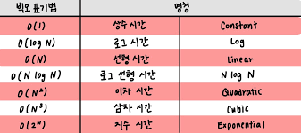

# 시간복잡도

알고리즘을 위해 필요한 연산의 수        
*연산* -> 보통 사칙 연산, 비교 연산과 같은 기본 연산을 취급
<br><br>

## 빅오(Big-O) 표기법

함수의 상한만을 나타냄



<br>

>c언어 기준으로, 연산 횟수가 10억을 넘어가면 1초 이상의 시간 소요        
ex) N의 범위가 2,000인 경우 ,O(N^2)이면 풀 수 있다.

<br><br>

# 공간복잡도

알고리즘을 위해 필요한 메모리의 양

시간과 동일하게 빅오 표기법 이용 (ex) O(NlogN), O(N)

int형 기준으로,  
int a[1000] : 4KB   
int a[1000000] : 4MB   
int a[2000][2000] : 16MB
<br><br>

>보통 문제에서 128MB ~ 512MB 정도로 제한

<br><br>

# Chapter 3.  그리디 알고리즘 (탐욕법)

현재 상황에서 가장 좋아보이는 것만을 선택하는 알고리즘, 단순 무식하게, 탐욕적으로 푸는 알고리즘<br><br>

## 예제 3-1 거스름돈 문제
---
<br>

*  1번째 방법

```
	// 3-1 거스름돈 문제
	public static void change(int money) {
		//ex) 1260원이면, 500 -> 2개, 100 -> 2개, 50 -> 1개 ,10 -> 1개
		int count = 0;
		int num500 = money / 500;		//2개
		count += num500;
		int changemoney = money % 500;	//남은 돈 260원
		System.out.println("500원의 개수 : " + num500);
		
		int num100 = changemoney / 100;	//2개
		count += num100;
		changemoney %= 100;				//남은 돈 60원
		System.out.println("100원의 개수 : " + num100);
		
		int num50 = changemoney / 50;	//1개
		count += num50;
		changemoney %= 50;				//남은 돈 10원
		System.out.println("50원의 개수 : " + num50);
		
		int num10 = changemoney / 10;	//1개
		count += num10;
		System.out.println("10원의 개수 : " + num10);
		System.out.println("동전의 최소 개수 : " + count);
	}
```
<br>
<br>

* 2번째 방법 (교재 참조)

```
public static void easychange(int money) {
		int count = 0;
		int[] arr = {500, 100, 50, 10};
		for(int i=0 ; i<arr.length ; i++) {
			count += money / arr[i];
			money %= arr[i];
		}
		System.out.println("동전의 최소 개수 : " + count);
	}
```

- [ ] 시간복잡도        
화폐 종류가 N개일 시, 시간복잡도 O(N) => 동전의 총 종류에만 영향을 받고, 거슬러줘야하는 금액의 크기는 상관없다.     
<br><br>

## 그리디 알고리즘의 정당성
---


그리디를 이용하면, 그 해법이 정당한지 검토해야 한다.<br>
거스름돈 문제를 그리디로 해결할 수 있는 이유는, 가지고 있는 동전 중에서 큰 단위가 항상 작은 단위의 배수이므로 작은 단위의 동전들을 종합해 다른 해가 나올 수 없기 때문이다.

ex) 800원을 거슬러 줄 떄, 화폐 단위가 500, 400 ,100이면 그리디로는 4개(500+100+100+100)이 나오는데, 최적의 해는 2개(400+400)이다.<br>

안되는 이유는 큰 단위(500)가 작은 단위의 배수가 아니므로, 이 처럼 무작위로 주어진 경우는 그리디 알고리즘으로 해결할 수 없다.
<br> <br>

## 예제 3-2 큰 수의 법칙
---
>제한시간 1초, 메모리 제한 128MB

<br>

*  1번째 방법

```
public static int maxSum(int[] arr, int countnum , int maxt) {
    //최대값이 여러개 일 수 있으므로, arr과 길이가 같은 배열을 만들어서 최대값의 index를 1로 저장
    //맨 처음 값으로 max를 설정했으니, 중복값이 있으면 계속 1로 저장하다가 max값이 바뀌면 다시 리셋
		int sum = 0;
		int max1, max2;		//max1이 가장 큰 수, max2는 두번째로 큰 수(같아도 상관 없음)
		if(arr[0] > arr[1]) {
			max1 = arr[0];
			max2 = arr[1];
		}
		else {
			max1 = arr[1];
			max2 = arr[0];
		}
		
		// 2 8 3
		// 3 5		배열의 길이가 2일때, 5+5+5+3 +5+5+5+3
		
		//최대값 2개 찾기
		// i=2부터하면 길이가 2일때 index out of range 에러 뜰 수도 있으니 i=0부터
		for(int i=0 ; i<arr.length ; i++) {
			if(max1 < arr[i]) {
				max2 = max1;
				max1 = arr[i];
			}
			else if(max2 < arr[i] && arr[i] <= max1 )
				max2 = arr[i];
		}
		
		int maxtcopy = maxt;
		while(countnum != 0) {
			sum += max1;
			maxt--;
			countnum--;
			if (maxt==0) {
				countnum--;
				sum += max2;
				maxt = maxtcopy;
			}
		}
		return sum;
	}
```
<br>
<br>

* 2번째 방법 (교재 참조)

```
//점화식을 사용해 푸는 법
	//제일 큰 수 3번, 2번째로 큰 수 1번이 계속 반복되므로, 점화식을 이용해 풀기 ex) 6 6 6 5 / 6 6 6 5 반복
	public static int easyMaxSum(int[] arr, int countnum, int maxt) {
		Arrays.sort(arr);
		int arrlen = arr.length;
		int max1 = arr[arrlen-1];
		int max2 = arr[arrlen-2];
		
		int repeat = countnum / (maxt+1);	// 반복구간의 반복횟수
		int partSum = max1*3 + max2;		// 한 반복구간의 합
		int leftNum = countnum % (maxt+1);	// 나머지숫자의 개수
		int left = leftNum * max1;			// 반복구간에 포함되지 않는 나머지의 합
		
		return (repeat * partSum) + left;
	}
```
<br>


## 예제 3-3 숫자 카드 게임
---
>제한시간 1초, 메모리 제한 128MB

<br>

*  1번째 방법

```
public static int numCardGame(int[][] arr) {
		int x = arr.length;
		int y = arr[0].length;
		int minNum;
		int smallest = 0;					//가장 작은 수 중 제일 큰 수
		for(int i=0 ; i<x ; i++) {
			minNum = arr[i][0];
			for(int j=0 ; j<y ; j++) {		// 각 행마다의 가장 작은 수를 탐색
				if(minNum > arr[i][j])
					minNum = arr[i][j];
			}
			if(smallest < minNum)
				smallest = minNum;
		}
		return smallest;
	}
```
<br>
<br>

* 2번째 방법 (교재 참조)

```
1. 파이썬 이용시, min()함수를 이용해서 한줄 입력받고, 바로 최소값 찾은 후, 그 중에서 max()이용하면 됨

2. 2중 for문 사용
```

- [ ] 시간복잡도        
시간복잡도를 따졌을 때도 O(N^2)이지만, 1 <= N,M <= 100이므로, 최대가 10,000로 1초안에 풀 수 있다.
<br><br>

## 예제 3-4 / 1이 될 때까지
---
>제한시간 1초, 메모리 제한 128MB

<br>

*  1번째 방법

```
public static int until1(int n, int k) {
		int count = 0;
		while(n!=1) {
			
			if(n%k==0) {
				n /= k;
			}
			else
				n -= 1;
			++count;
		}
		return count;
	}
```
<br>
<br>

# Chapter 11.  그리디 알고리즘 문제

## 예제 11-1 모험가 길드
---
>제한시간 1초, 메모리 제한 128MB

<br>

*  1번째 방법

```
public static int maxGroup(int[] arr) {
		Arrays.sort(arr);
		int arrlen = arr.length;
		int groupCount = 0;
		int scared = arr[arrlen-1];		// 가장 높은 공포도를 가진 사람
		
		while(true) {
			arrlen -= scared;
			groupCount++;
			if(arrlen <=0)
				break;
			scared = arr[arrlen-1];
		}
		return groupCount;
	}
```

- [ ] 실수한 부분       
공포도의 값은 N이하로 주어졌다는 것을 못봄. 문제 꼼꼼히 읽기

<br>
<br>

## 예제 11-2 곱하기 혹은 더하기
---
>제한시간 1초, 메모리 제한 128MB

<br>

*  1번째 방법

```
public static int biggestNum(String str) {
		int strlen = str.length();
		int[] numarr = new int[strlen];
		int num = Integer.parseInt(str);	// 숫자로 변환한 것을 numarr배열에 한 숫자씩 넣기
		for(int i=0 ; i<strlen ; i++) {		// ex)567 -> {7, 6, 5} 순서는 상관이 없음, 어차피 연산할것이기 때문에
			numarr[i] = num % 10;
			num /= 10;
		}
		return calculate(numarr, 0, 0);
	}

	//한 숫자씩 담은 배열을 재귀호출로 돌려서 모든 경우의 수를 계산해서 제일 큰 값 찾기
	public static int calculate(int[] arr, int depth, int result) {
		if(depth == arr.length)
			return result;
		int a = calculate(arr, depth+1, result + arr[depth]);
		int b = calculate(arr, depth+1, result * arr[depth]);
		if(a < b)
			return b;
		else 
			return a;
	}
```

- [ ] 시간복잡도        
1 <= 문자열의 길이(S) <= 20      
두 가지의 연산 '*' or '+' 를 사용하고, 최대 연산자의 개수가 19개이므로  
최대 시간은 2^19 / 대략적으로 계산해보면 1,000,000이므로 모든 경우의 수를 다 해봐도 1초안에 해결 가능하다.

<br>
<br>

* 2번째 방법 (교재 참조)

```
public static void main(String[] args) {
        Scanner sc = new Scanner(System.in);
        String str = sc.next();

        // 첫 번째 문자를 숫자로 변경한 값을 대입
        long result = str.charAt(0) - '0';
        
        for (int i = 1; i < str.length(); i++) {
            // 두 수 중에서 하나라도 '0' 혹은 '1'인 경우, 곱하기보다는 더하기 수행
            int num = str.charAt(i) - '0';
            if (num <= 1 || result <= 1) {
                result += num;
            }
            else {
                result *= num;
            }
        }

        System.out.println(result);
    }
```

- [ ] Key Point (놓친 부분)     
두 수의 연산을 할 때, 두 수 중에 하나라도 1이하인 경우에는 더하는 게 더 크고,   
(ex) 1 + 2 = 3 / 1 * 2 = 2    
두 수가 모두 2이상이면 곱하는 게 더 크다.   
(ex) 6 + 5 = 11 / 6 * 5 = 30    

<br><br>

## 예제 11-3 문자열 뒤집기
---
>제한시간 2초, 메모리 제한 128MB

<br>

*  1번째 방법

```
public static int reverse(String str) {
		String s1 = str.substring(0, 1);		// 0번째 index
		String s2 = "";
		int zeroCount = 0;
		int oneCount = 0;
		if(s1.equals("0"))
			zeroCount++;
		else 
			oneCount++;
		
		// 0과 1이 뒤바뀌는 타이밍이 구간이 바뀌는 시작점
		for(int i=1 ; i<str.length() ; i++) {		
			s1 = str.substring(i, i+1);
			s2 = str.substring(i-1, i);
			if(s1.equals("1") && s2.equals("0"))
				oneCount++;
			else if(s1.equals("0") && s2.equals("1"))
				zeroCount++;
		}
		
		if(zeroCount > oneCount)
			return oneCount;
		else 
			return zeroCount;
	}
```
<br>
<br>

>어차피 0, 1 구간은 무조건 1구간 차이가 나므로, 작은 구간의 횟수가 답이다.  
0 : 5구간    
1 : 3구간   
이렇게 생성될 수 없음으로 0, 1이 붙어있는 구간의 횟수를 계산하면 된다.

<br><br>

## 예제 11-4 만들 수 없는 금액
---
### ★어려운 문제★
>제한시간 1초, 메모리 제한 128MB

<br>

*  1번째 방법 (교재 참조)

```
public static int cantMake(int[] arr) {
		Arrays.sort(arr);
		int target = 1;
		for(int i : arr) {
			if(target < i)
				break;
			target += i;
		}
		return target;
	}
```
<br>
<br>


## 예제 11-5 볼링공 고르기
---
>제한시간 1초, 메모리 제한 128MB

<br>

*  1번째 방법

```
public static int choose(int[] arr) {
		int count = 0;
		for(int i=0 ; i<arr.length-1 ; i++)
			for(int j=i+1 ; j<arr.length ; j++) {
				if(arr[i] != arr[j])
					count++;
			}
		return count;
	}
```
<br>
<br>

* 2번째 방법 (교재 참조)

```
무게를 오름차순으로 정렬시켜놓은 후, 작은 무게부터 짝지을 수 있는 개수를 정하고, 그 다음 무게부터는 중복이 안되는 선에서 짝지을 수 있는 개수 구하기
(ex)
1 3 2 3 2
sort후
1 2 2 3 3
무게 1 : 1개    1(무게가 1인 공의 개수) * 4(짝지을 수 있는 경우의 수) => 4가지
무게 2 : 2개    2(무게가 2인 공의 개수) * 2(짝지을 수 있는 경우의 수) => 4가지
무게 3 : 2개    2(무게가 3인 공의 개수) * 0(짝지을 수 있는 경우의 수) => 0가지
==> 총 8가지
```

- [ ] 시간복잡도        
시간복잡도를 따지면 O( (N*(N-1)) / 2)이다.  
 1 <= N <= 1,000이므로, 최대가 1,000,000 으로 1초안에 풀 수 있다.

<br><br>

## 예제 11-6 무지의 먹방 라이브
---
>제한시간 1초, 메모리 제한 128MB

<br>

*  1번째 방법

```
public static int solution(int[] food_times, long k) {
		int i = 0;
		
		int sum = 0;
		for(int e : food_times)
			sum += e;
		if(k >= sum)
			return -1;
		
		while(k > 0) {
			if(food_times[i] == 0)
				++i;
			food_times[i++] -= 1;
			k--;
			if(i == food_times.length)		// 배열을 한번 다 돌면 처음부터 다시 돌기
				i = 0;
		}
		
		while(food_times[i] == 0) {
			++i;
			if(i == food_times.length)		
				i = 0;
		}
		
		return i+1;
	}
```

<br><br>
교재에 있는 예시와 몇개의 예시에서는 답이 나오지만, 프로그래머스 사이트에서 정확성, 효율성테스트를 통과 못해서 조금 더 보안해야 할 코드입니다.

<br>

* 교재의 정답 참고  
내장되어있는 우선순위 큐를 사용해서 구현